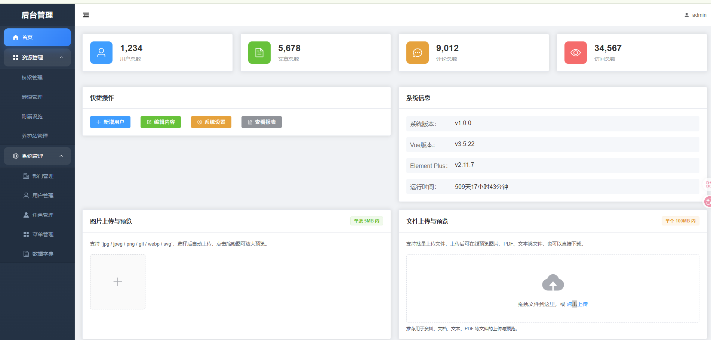
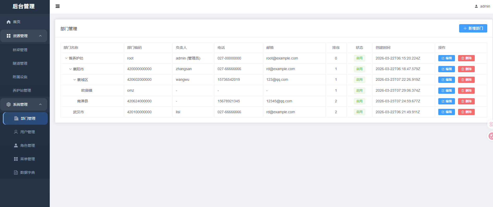
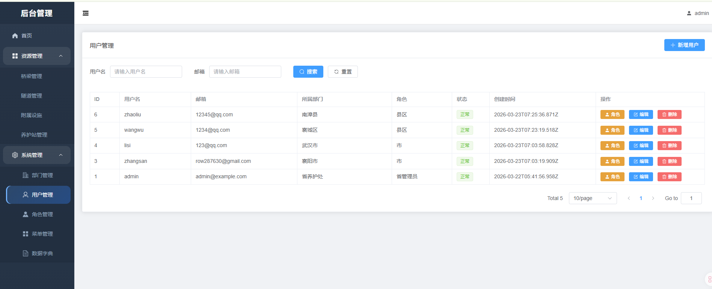
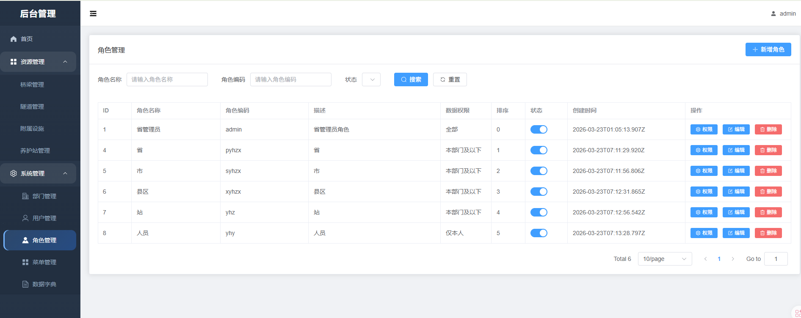
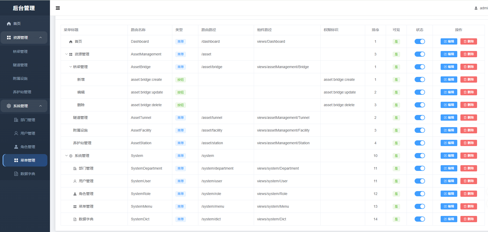
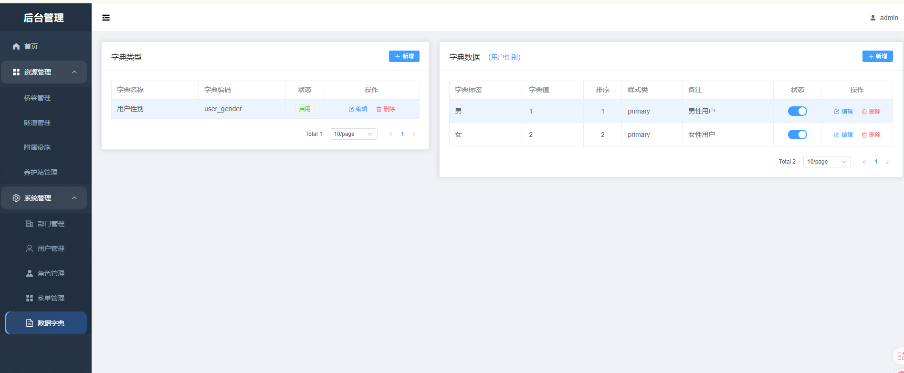
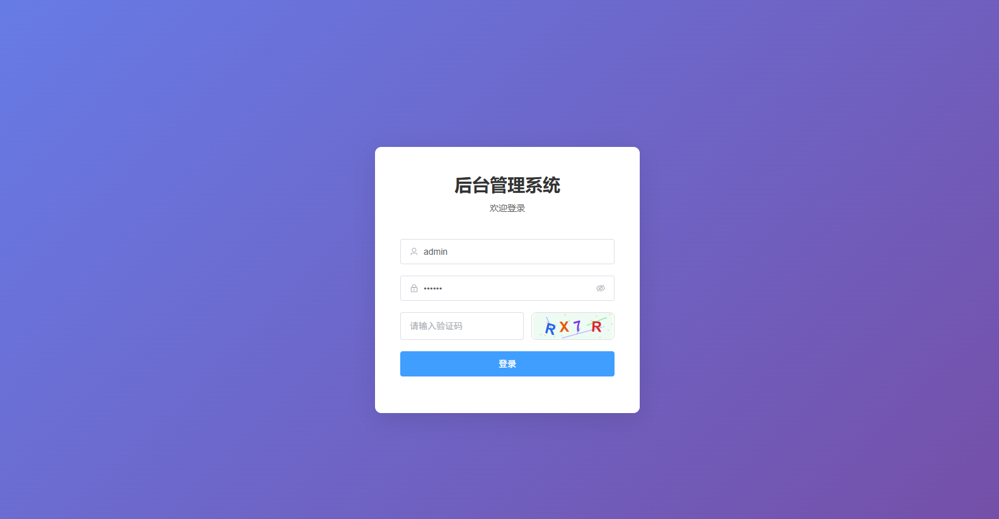
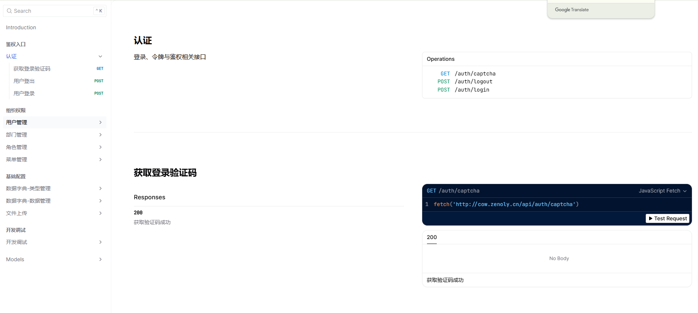

# NestJS Admin System + Vue 3 / Vue3 Admin Template | RBAC Permission Management Monorepo

[中文](#中文说明) | [English](#english)

Enterprise-ready admin system monorepo built with NestJS, Vue 3, Vue3, Prisma, PostgreSQL, Redis, and MinIO. Suitable for admin dashboard, RBAC permission management, file upload management, back-office platform, and internal system starter projects.

面向企业后台与管理中台场景的 `NestJS + Vue3` 单仓项目，覆盖 `RBAC 权限管理`、`用户角色菜单部门字典`、`MinIO 文件上传`、`Prisma + PostgreSQL`、`Redis` 与 `前后端联调` 能力。

Keywords: `nestjs`, `nest`,`nest.js`,`NestJS`,`vue3`, `admin system`, `admin template`, `rbac`,`RBAC`, `permission management`, `minio`, `file upload`, `prisma`, `postgresql`, `redis`, `monorepo`,`后台管理系统`

### Core Features

- JWT 登录认证与 RBAC 权限管理
- 用户管理、角色管理、菜单管理、部门管理、字典管理
- 动态菜单、按钮权限、权限指令
- MinIO 文件上传与资源管理
- NestJS + Prisma + PostgreSQL + Redis 后端能力
- Vue 3 + Vite + Element Plus 管理后台前端
- 适合作为后台管理系统、权限平台、运营平台、数据中台基础底座

### Quick Links

- Demo: [http://cow.zenoly.cn/login](http://cow.zenoly.cn/login)
- API Docs: [http://cow.zenoly.cn/api-docs#tag/%E8%AE%A4%E8%AF%81](http://cow.zenoly.cn/api-docs#tag/%E8%AE%A4%E8%AF%81)
- Frontend: [admin-front/README.md](./admin-front/README.md)
- Backend: [admin-backend/README.md](./admin-backend/README.md)

## 中文说明

这是一个面向企业后台场景的 `NestJS + Vue 3` 管理后台 monorepo，也是一个可直接二开的 `RBAC 权限管理系统 / 后台管理模板 / Admin System Starter`。

### 搜索关键词

如果你正在 GitHub 搜索下面这些关键词，这个仓库就是对应方向的项目：

- nestjs / NestJS / nest js
- vue3 / Vue3 / Vue 3
- NestJS 后台管理系统
- Vue 3 管理后台 / Vue 3 admin template
- RBAC 权限管理系统 / 权限管理平台
- 文件上传系统 / 文件管理后台 / Minio 文件上传
- 后台管理系统脚手架 / admin dashboard starter
- NestJS + Prisma + PostgreSQL + Redis + MinIO
- 数据中台权限系统底座 / 管理中台基础项目
- 企业级 admin 系统 / monorepo 管理平台

它不是“只能演示页面”的后台模板，也不是“只有接口缺少业务骨架”的半成品，而是一套可以直接落地、继续二开、适合作为真实项目底座的后台基础设施：

- `admin-front`：基于 Vue 3 + Vite + Element Plus 的管理端前端
- `admin-backend`：基于 NestJS + Prisma + PostgreSQL + Redis + MinIO 的后端 API

这个根目录现在作为统一入口，负责：

- 管理前后端代码目录
- 提供统一的 `pnpm workspace`
- 提供根级开发命令
- 提供适合放在 GitHub 首页的总说明

### 项目定位

如果你在找的不是一个“只会展示登录页和表格页”的后台壳子，而是一套可以直接支撑真实管理系统的权限中台型基础项目，这个仓库就是为这种场景准备的。

它强调三件事：

- 能打：账号、角色、菜单、按钮、部门、字典、上传这些后台常见核心能力已经串起来
- 能上手：本地开发、Docker 依赖、接口文档、前后端联调链路都已经配好
- 能扩展：权限模型、菜单树、角色关系、数据权限边界都留好了继续演进的空间

### 项目亮点

- 完整 RBAC 权限模型：覆盖账号、部门、角色、菜单、按钮权限和数据权限扩展能力，不是零散模块堆叠，而是完整权限链路
- 企业级后台核心能力现成可用：用户管理、角色管理、菜单管理、部门管理、数据字典、文件上传、认证鉴权一套齐全
- 动态菜单真正可落地：菜单驱动路由、按钮驱动权限、前后端权限消费链路打通，适合真实业务后台直接接入
- 实战导向而不是 Demo 导向：统一响应、参数校验、异常处理、OpenAPI/Scalar 文档、Docker 部署链路都已经具备
- 前后端职责清晰：前端负责权限消费、菜单渲染和页面体验，后端负责认证、菜单树、角色关系和访问边界
- 开箱即用又便于二开：既可以直接作为中后台脚手架使用，也适合作为团队内部管理平台、权限平台、SaaS 控台底座
- 单仓协作更省心：前后端放在同一个 monorepo 中，统一依赖、统一命令、统一说明，降低项目维护和交接成本

### 项目预览

- 在线体验地址：[http://cow.zenoly.cn/login](http://cow.zenoly.cn/login)
- 演示账号：`admin`
- 演示密码：`123456`
- 后端接口文档：[http://cow.zenoly.cn/api-docs#tag/%E8%AE%A4%E8%AF%81](http://cow.zenoly.cn/api-docs#tag/%E8%AE%A4%E8%AF%81)










### 你能直接拿去做什么

- 作为公司内部管理后台的初始工程
- 作为业务系统的权限与系统管理基础模块
- 作为中后台项目脚手架，快速起盘一个“能登录、能控权、能配菜单、能上传”的管理系统
- 作为团队学习 NestJS + Vue 3 + Prisma + PostgreSQL 的实战型参考项目

### 适用场景

- 企业内部管理后台
- 中后台权限平台 / 系统管理平台
- 数据中台、资产平台、运营平台中的账号权限与系统管理底座
- 需要用户、角色、菜单、字典、上传能力的业务系统
- 希望“拿来即用”同时又保留二次开发空间的实战项目

### 项目结构

```text
.
├─ admin-backend/          NestJS 后端
├─ admin-front/            Vue 3 前端
├─ package.json            根级统一脚本
├─ pnpm-workspace.yaml     pnpm workspace 配置
└─ README.md               中英双语总说明
```

### 技术栈

- Frontend: Vue 3, Vite, Element Plus, Pinia, Vue Router
- Backend: NestJS 11, Prisma 6, PostgreSQL 15, Redis 7, MinIO
- Tooling: pnpm, Docker Compose

### 环境要求

- Node.js 18+
- pnpm 8+
- Docker Desktop / Docker Compose

### 本地运行前提

在本地启动项目前，请先确认下面 3 个依赖服务已经可用：

- PostgreSQL
- Redis
- MinIO

这个仓库默认约定的本地端口如下：

- PostgreSQL: `localhost:15432`
- Redis: `localhost:16379`
- MinIO API: `localhost:19000`
- MinIO Console: `localhost:19001`

如果你不想手动一个个启动，直接执行下面这条命令即可拉起本地依赖服务：

```bash
pnpm docker:deps:up
```

### 本地快速开始

1. 克隆项目

```bash
git clone https://github.com/rowan766/nest-front-backend.git
cd nest-front-backend
```

2. 安装依赖

```bash
pnpm install
```

3. 启动 PostgreSQL、Redis、MinIO

```bash
pnpm docker:deps:up
```

4. 同步数据库表结构

```bash
pnpm db:push
```

5. 启动后端

```bash
pnpm dev:backend
```

6. 启动前端

```bash
pnpm dev:front
```

### 推荐启动顺序

为了避免第一次启动时连接失败，建议按下面顺序运行：

1. `pnpm docker:deps:up`
2. `pnpm install`
3. `pnpm db:push`
4. `pnpm dev:backend`
5. `pnpm dev:front`

### 首次初始化说明

`pnpm db:push` 只会创建数据库表结构，不会自动导入管理员账号、角色、菜单、字典等业务数据。

也就是说，如果你是第一次 clone 仓库并且使用的是全新的本地数据库，那么：

- 后端可以正常启动
- 前端页面也可以打开
- 但如果数据库里没有初始化管理员和菜单数据，登录后可能无法进入完整系统

如果你希望本地体验完整后台能力，建议至少准备：

- 一个管理员账号
- 基础角色数据
- 基础菜单数据
- 用户与角色、角色与菜单的关联数据

### 导入仓库内置示例数据

仓库根目录已经提供了一份示例数据文件：

- [admin_system_dump_utf8.sql](./admin_system_dump_utf8.sql)

如果你已经启动了本地 PostgreSQL 容器，并且端口映射为 `15432:5432`，可以按下面步骤导入这份示例数据。

1. 先确认本地 PostgreSQL 已启动

```bash
docker ps
```

2. 如果数据库还没有创建，先创建 `admin_system`

```bash
docker exec -it nestjs-project1-postgres psql -U postgres -c "CREATE DATABASE admin_system;"
```

3. 如果你想覆盖成仓库附带的完整示例数据，建议先重建数据库

```bash
docker exec -it nestjs-project1-postgres psql -U postgres -c "DROP DATABASE IF EXISTS admin_system;"
docker exec -it nestjs-project1-postgres psql -U postgres -c "CREATE DATABASE admin_system;"
```

4. 导入示例 SQL

Windows PowerShell:

```powershell
Get-Content .\admin_system_dump_utf8.sql | docker exec -i nestjs-project1-postgres psql -U postgres -d admin_system
```

macOS / Linux / Git Bash:

```bash
docker exec -i nestjs-project1-postgres psql -U postgres -d admin_system < admin_system_dump_utf8.sql
```

5. 导入完成后，再启动后端和前端

```bash
pnpm dev:backend
pnpm dev:front
```

导入成功后，你就可以直接使用仓库中已有的管理员、角色、菜单等基础数据进行体验，而不需要手动一条条创建。

### 本地访问地址

- Frontend: `http://localhost:5173`
- Backend: `http://localhost:3101`
- API Docs: `http://localhost:3101/api-docs`
- OpenAPI JSON: `http://localhost:3101/api-docs-json`
- MinIO Console: `http://localhost:19001`

### 本地联调说明

- 前端开发服务器默认会把 `/api` 代理到 `http://localhost:3101`
- 所以前端本地访问接口时，不需要手动改成完整后端域名
- 只要后端本地启动成功，前端就可以直接联调
- 本地开发使用的是仓库中的本地环境配置，不会影响你服务器上的生产配置

### 常见问题

- `pnpm db:push` 成功了但登录失败：
  这通常不是后端没启动，而是数据库里还没有初始化管理员账号或菜单数据
- 前端能打开但接口请求失败：
  请先确认后端是否成功运行在 `http://localhost:3101`
- 文件上传失败：
  请确认 MinIO 已启动，并且本地端口是 `19000 / 19001`
- 接口文档接口请求失败
  请先用前端页面登录在浏览器缓存中取到token粘贴到鉴权接口的BearerToken的值中

### 线上演示

- 前端演示地址：[http://cow.zenoly.cn/login](http://cow.zenoly.cn/login)
- 测试账号：`admin`
- 测试密码：`123456`
- 后端接口文档：[http://cow.zenoly.cn/api-docs#tag/%E8%AE%A4%E8%AF%81](http://cow.zenoly.cn/api-docs#tag/%E8%AE%A4%E8%AF%81)

### 独立仓库

- 如果需要单独的后端，请访问：[https://github.com/rowan766/admin-backend](https://github.com/rowan766/admin-backend)
- 如果需要单独的前端，请访问：[https://github.com/rowan766/admin-front](https://github.com/rowan766/admin-front)

### 前后端联调关系

- 前端开发服务器默认把 `/api` 代理到 `http://localhost:3101`
- 后端默认端口是 `3101`
- 因此前后端本地联调时，通常只需要先启动后端，再启动前端即可

### 根目录常用命令

```bash
pnpm dev:front
pnpm dev:backend
pnpm build
pnpm build:front
pnpm build:backend
pnpm lint:backend
pnpm test:backend
pnpm test:e2e:backend
pnpm docker:deps:up
pnpm docker:backend:up
pnpm docker:down
pnpm db:push
```

### 子项目文档

- Frontend README: [admin-front/README.md](./admin-front/README.md)
- Frontend Architecture: [admin-front/README_ARCHITECTURE.md](./admin-front/README_ARCHITECTURE.md)
- Backend README: [admin-backend/README.md](./admin-backend/README.md)
- Backend Architecture: [admin-backend/README_ARCHITECTURE.md](./admin-backend/README_ARCHITECTURE.md)
- Backend Deploy Guide: [admin-backend/deploy.md](./admin-backend/deploy.md)

### 仓库整合说明

这个目录原本是两个独立项目：

- `admin-front`
- `admin-backend`

现在已经改为单仓管理，更适合：

- 一个 GitHub 仓库同时管理前后端
- 统一维护 README 和开发入口
- 后续扩展 CI/CD、issue、release 和部署流程

为避免直接删除原仓库历史，两个子项目原有的 Git 元数据已被本地重命名为 `.git.backup` 作为备份；确认不再需要后可以手动删除。

## English

Enterprise-ready `NestJS + Vue 3 / Vue3` admin system monorepo for RBAC permission management, admin dashboard, file upload management, back-office platform, and internal tools.

### Search Keywords

- nestjs / nest js
- vue3 / vue 3
- nestjs admin system
- NestJS admin template
- Vue 3 admin dashboard
- file upload admin system
- MinIO file upload starter
- RBAC admin system
- Permission management platform
- data platform permission foundation
- NestJS Prisma PostgreSQL Redis MinIO starter
- Monorepo back-office platform

This repository is organized as a single monorepo for an enterprise-ready RBAC admin platform.

It is not just a visual admin template and not merely a set of backend endpoints. It is meant to serve as a production-oriented foundation that teams can launch with, extend, and keep evolving:

- `admin-front`: Vue 3 + Vite + Element Plus admin frontend
- `admin-backend`: NestJS + Prisma + PostgreSQL + Redis + MinIO backend API

The root directory is the single entry point for:

- keeping frontend and backend in one repository
- managing them with `pnpm workspace`
- providing shared root-level scripts
- offering a GitHub-friendly project overview

### Positioning

If you need more than a login page and a few demo tables, and you want a project that already captures the real backbone of an admin platform, this repository is aimed squarely at that use case.

It focuses on three things:

- Ready for real work: core admin modules and permission relationships are already connected
- Ready to start: local setup, Docker dependencies, API docs, and frontend/backend integration are already in place
- Ready to scale: the permission model and system boundaries are structured for further extension instead of blocking future growth

### Highlights

- Unified RBAC capability spanning accounts, departments, roles, menus, button permissions, and extensible data-scope logic
- Production-minded admin modules out of the box, including authentication, users, roles, menus, departments, dictionaries, and file uploads
- Dynamic menu and permission flow that is actually usable in real admin systems instead of remaining a disconnected demo
- Enterprise-oriented engineering practices with validation, exception handling, unified responses, OpenAPI/Scalar docs, and Docker-based deployment
- Clear frontend/backend ownership: the frontend consumes permissions and renders menu experiences, while the backend owns identity, role relations, and access boundaries
- Suitable both as a starter kit for business admin projects and as a reusable foundation for internal platforms or SaaS control panels
- Monorepo collaboration model that keeps frontend and backend aligned with shared tooling, shared commands, and lower maintenance overhead

### Preview

- Online demo: [http://cow.zenoly.cn/login](http://cow.zenoly.cn/login)
- Demo account: `admin`
- Demo password: `123456`
- API docs: [http://cow.zenoly.cn/api-docs#tag/%E8%AE%A4%E8%AF%81](http://cow.zenoly.cn/api-docs#tag/%E8%AE%A4%E8%AF%81)

### What You Can Build With It

- Internal enterprise admin systems
- Permission and system-management platforms
- Back-office products that need users, roles, menus, dictionaries, and upload capabilities from day one
- A practical learning or starter project for NestJS + Vue 3 + Prisma + PostgreSQL in a real admin scenario

### Best For

- Internal enterprise admin systems
- Back-office operation platforms
- Permission platforms and system-management portals
- Projects that should be usable out of the box while still remaining easy to extend

### Structure

```text
.
├─ admin-backend/          NestJS backend
├─ admin-front/            Vue 3 frontend
├─ package.json            root scripts
├─ pnpm-workspace.yaml     pnpm workspace config
└─ README.md               bilingual overview
```

### Stack

- Frontend: Vue 3, Vite, Element Plus, Pinia, Vue Router
- Backend: NestJS 11, Prisma 6, PostgreSQL 15, Redis 7, MinIO
- Tooling: pnpm, Docker Compose

### Requirements

- Node.js 18+
- pnpm 8+
- Docker Desktop / Docker Compose

### Prerequisites For Local Development

Before running the project locally, make sure these three services are available:

- PostgreSQL
- Redis
- MinIO

This repository assumes the following local ports by default:

- PostgreSQL: `localhost:15432`
- Redis: `localhost:16379`
- MinIO API: `localhost:19000`
- MinIO Console: `localhost:19001`

If you want to start them with one command, run:

```bash
pnpm docker:deps:up
```

### Local Quick Start

1. Clone the repository

```bash
git clone https://github.com/rowan766/nest-front-backend.git
cd nest-front-backend
```

2. Install dependencies

```bash
pnpm install
```

3. Start PostgreSQL, Redis, and MinIO

```bash
pnpm docker:deps:up
```

4. Push the Prisma schema

```bash
pnpm db:push
```

5. Start the backend

```bash
pnpm dev:backend
```

6. Start the frontend

```bash
pnpm dev:front
```

### Recommended Startup Order

For a smoother first-time run, use this order:

1. `pnpm docker:deps:up`
2. `pnpm install`
3. `pnpm db:push`
4. `pnpm dev:backend`
5. `pnpm dev:front`

### First-Time Initialization Notes

`pnpm db:push` creates the database schema only. It does not automatically insert an admin user, roles, menus, dictionaries, or other business data.

So on a completely fresh local database:

- the backend can still start normally
- the frontend can still open normally
- but you may not be able to fully use the system until initial admin and menu data are prepared

To get the full admin experience locally, it is recommended to prepare at least:

- one admin account
- base role data
- base menu data
- user-role and role-menu relation data

### Sample Data Recommendation

If you plan to publish this repository as an open-source project, it is a good idea to make it explicit that the project does not automatically bundle full demo data, and that first-time users may need a minimal initialization dataset.

The minimum recommended dataset usually includes:

- an admin account
- a super admin role
- a dashboard menu
- menus for user, role, menu, department, and dictionary management
- user-role relations
- role-menu relations

Two practical approaches are recommended:

- Option 1: provide an initialization SQL file for manual import
- Option 2: add a seed script later so users can populate base data right after `pnpm db:push`

If the repository does not yet include a built-in seed process, README should state that clearly so users do not assume that schema creation alone is enough for a full login experience

### Import The Built-In Demo SQL

The repository already includes a demo SQL file at the root:

- [admin_system_dump_utf8.sql](./admin_system_dump_utf8.sql)

If your local PostgreSQL container is already running and mapped as `15432:5432`, you can import the demo data with the steps below.

1. Make sure PostgreSQL is running

```bash
docker ps
```

2. Create the `admin_system` database if it does not exist yet

```bash
docker exec -it nestjs-project1-postgres psql -U postgres -c "CREATE DATABASE admin_system;"
```

3. If you want to replace the current local data with the full demo dataset, recreate the database first

```bash
docker exec -it nestjs-project1-postgres psql -U postgres -c "DROP DATABASE IF EXISTS admin_system;"
docker exec -it nestjs-project1-postgres psql -U postgres -c "CREATE DATABASE admin_system;"
```

4. Import the SQL file

Windows PowerShell:

```powershell
Get-Content .\admin_system_dump_utf8.sql | docker exec -i nestjs-project1-postgres psql -U postgres -d admin_system
```

macOS / Linux / Git Bash:

```bash
docker exec -i nestjs-project1-postgres psql -U postgres -d admin_system < admin_system_dump_utf8.sql
```

5. Start the backend and frontend after the import

```bash
pnpm dev:backend
pnpm dev:front
```

After the import, you can use the built-in admin, role, menu, and other base data for a smoother local demo experience.

### Local URLs

- Frontend: `http://localhost:5173`
- Backend: `http://localhost:3101`
- API Docs: `http://localhost:3101/api-docs`
- OpenAPI JSON: `http://localhost:3101/api-docs-json`
- MinIO Console: `http://localhost:19001`

### Local Integration Notes

- The frontend dev server proxies `/api` to `http://localhost:3101`
- You do not need to hardcode a backend domain for local frontend/backend integration
- As long as the backend is running locally, the frontend can call it directly
- Local development uses local environment settings and does not affect your production server configuration

### Common Issues

- `pnpm db:push` succeeds but login still fails:
  the database schema exists, but the admin account or base menu data is still missing
- The frontend opens but API requests fail:
  make sure the backend is really running at `http://localhost:3101`
- File upload fails:
  make sure MinIO is started and available on `19000 / 19001`

### Online Demo

- Frontend demo: [http://cow.zenoly.cn/login](http://cow.zenoly.cn/login)
- Demo account: `admin`
- Demo password: `123456`
- API docs: [http://cow.zenoly.cn/api-docs#tag/%E8%AE%A4%E8%AF%81](http://cow.zenoly.cn/api-docs#tag/%E8%AE%A4%E8%AF%81)

### Standalone Repositories

- Standalone backend: [https://github.com/rowan766/admin-backend](https://github.com/rowan766/admin-backend)
- Standalone frontend: [https://github.com/rowan766/admin-front](https://github.com/rowan766/admin-front)

### Local integration

- The frontend dev server proxies `/api` to `http://localhost:3101`
- The backend listens on port `3101` by default
- In local development, start backend first, then start frontend

### Root scripts

```bash
pnpm dev:front
pnpm dev:backend
pnpm build
pnpm build:front
pnpm build:backend
pnpm lint:backend
pnpm test:backend
pnpm test:e2e:backend
pnpm docker:deps:up
pnpm docker:backend:up
pnpm docker:down
pnpm db:push
```

### Subproject docs

- Frontend README: [admin-front/README.md](./admin-front/README.md)
- Frontend Architecture: [admin-front/README_ARCHITECTURE.md](./admin-front/README_ARCHITECTURE.md)
- Backend README: [admin-backend/README.md](./admin-backend/README.md)
- Backend Architecture: [admin-backend/README_ARCHITECTURE.md](./admin-backend/README_ARCHITECTURE.md)
- Backend Deploy Guide: [admin-backend/deploy.md](./admin-backend/deploy.md)

To avoid permanently deleting the original repository metadata, the former nested Git directories were renamed locally to `.git.backup` inside each subproject. You can remove them later if you no longer need the backups.
